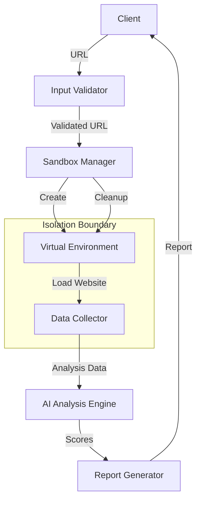

# Design Document: Website Authenticity Detector

## Overview

The Website Authenticity Detection System is a security tool that analyzes websites to determine if they are genuine or potentially fraudulent. The system loads target websites in an isolated virtual environment (sandbox), collects behavioral and structural data, and uses AI-powered analysis to generate authenticity probability scores.

### Key Design Goals

1. **Security First**: Complete isolation between the analysis environment and host system
2. **Comprehensive Analysis**: Multi-dimensional data collection covering network behavior, DOM structure, JavaScript execution, visual characteristics, and SSL certificates
3. **AI-Powered Detection**: Machine learning-based analysis to identify patterns indicative of fraudulent websites
4. **Robust Error Handling**: Graceful degradation with partial results when data collection is incomplete
5. **Clear Reporting**: Probability scores with confidence indicators and detailed analysis reports

### High-Level Architecture

The system consists of four primary components:

1. **Sandbox Manager**: Creates, manages, and destroys isolated virtual environments
2. **Data Collector**: Gathers behavioral and structural data from websites executing in the sandbox
3. **AI Analysis Engine**: Processes collected data to generate authenticity scores
4. **Report Generator**: Formats analysis results and generates structured reports

## Architecture

### Component Overview



### Component Responsibilities

#### Input Validator
- Validates URL format and protocol (HTTP/HTTPS only)
- Rejects private IP ranges and localhost to prevent internal network scanning
- Enforces URL length limits (max 2048 characters)
- Sanitizes URLs by percent-encoding special characters to prevent injection attacks
- Returns validation errors immediately without creating sandbox

#### Sandbox Manager
- Creates isolated virtual environments using containerization or VM technology
- Enforces isolation boundaries preventing file system writes, process creation, and network access to internal hosts
- Validates isolation boundary integrity before loading any website
- Manages sandbox lifecycle: initialization (max 15s), execution (max 30s), termination (max 10s)
- Implements forced termination with process kill if graceful shutdown fails
- Resets environment between analyses by deleting temporary files and reinitializing network isolation

**Technology Options:**
- **Docker containers** with security profiles (AppArmor/SELinux)
- **Playwright/Puppeteer** with isolated browser contexts
- **Firejail** for Linux process sandboxing
- **Virtual machines** for strongest isolation (higher resource cost)

#### Data Collector
- Operates within the virtual environment during website execution
- Collects five categories of data with independent failure handling:
  1. **Network Patterns**: request count, unique domains, protocol distribution
  2. **DOM Structure**: HTML content and structure
  3. **JavaScript Behavior**: script count, DOM modifications, external API calls
  4. **Visual Rendering**: screenshots, layout characteristics
  5. **SSL Certificate**: issuer, expiration, chain validation
- Implements 60-second collection timeout with continuation for in-progress tasks
- Aggregates collected data into Analysis_Data structure
- Marks data with timeout/failure flags for missing categories
- Logs sandbox escape attempts (file writes, process creation, internal network access)
- Handles redirects (max 5, with 10s timeout per redirect)

**Implementation Approach:**
- Use browser automation (Playwright/Puppeteer) for DOM, JavaScript, and visual data
- Use network proxy or browser DevTools Protocol for network patterns
- Use Python `ssl` module or OpenSSL for certificate inspection
- Implement async data collection with timeout handling per category

#### AI Analysis Engine
- Processes Analysis_Data to generate Authenticity_Score and Fake_Score
- Validates that scores are in range [0.0, 1.0] and sum to 1.0 (±0.01 tolerance)
- Requires at least 3 of 5 data categories to generate scores
- Returns errors for insufficient data or corrupted data
- Completes analysis within 10 seconds
- Supports partial score generation if error occurs mid-analysis
- Identifies top 3 factors influencing authenticity score for reporting

**AI Model Considerations:**
- **Initial Implementation**: Rule-based heuristics or simple classifier (e.g., Random Forest, Gradient Boosting)
- **Future Enhancement**: Deep learning models trained on labeled phishing datasets
- **Features**: URL characteristics, SSL validity, domain age, redirect patterns, JavaScript complexity, visual similarity to known brands
- **Output**: Two-class probability distribution (authentic vs fake)

#### Report Generator
- Formats analysis results into structured reports
- Includes: scores, confidence indicator, Analysis_Data elements, timestamps (ISO 8601 UTC), top 3 factors
- Lists data elements contributing to Fake_Score > 0.5
- Exports to JSON format conforming to defined schema
- Handles partial report generation when some fields fail
- Returns error messages indicating missing fields

### Data Flow

1. **Input Phase**: Client submits URL → Input Validator checks format/protocol/private IPs → Validated URL passed to Sandbox Manager
2. **Sandbox Phase**: Sandbox Manager creates Virtual Environment → Validates isolation boundary → Loads website with 30s timeout
3. **Collection Phase**: Data Collector gathers 5 data categories concurrently → Handles per-category failures → Aggregates into Analysis_Data with flags
4. **Analysis Phase**: AI Engine validates data completeness → Processes Analysis_Data → Generates Authenticity_Score and Fake_Score
5. **Reporting Phase**: Report Generator formats scores and data → Calculates confidence indicator → Exports JSON report
6. **Cleanup Phase**: Sandbox Manager terminates processes → Deletes temporary files → Resets isolation settings

### Security Architecture

#### Isolation Boundary Enforcement

The isolation boundary is the critical security control preventing malicious website code from affecting the host system.

**Three-Part Validation (Requirement 6.1):**
1. **File System Isolation**: Prevent write access to host file system
2. **Process Isolation**: Prevent process creation on host system  
3. **Network Isolation**: Prevent access to internal network addresses

Each validation must pass before website loading begins. Any failure triggers immediate termination within 2 seconds.

**Implementation Mechanisms:**
- **Container security profiles**: Read-only root filesystem, no-new-privileges flag, network policy restrictions
- **Browser sandbox**: Playwright/Puppeteer isolated contexts with restricted permissions
- **Monitoring**: Log all isolation boundary violations (file write attempts, process spawn attempts, internal IP connection attempts)

#### Attack Surface Minimization

- **No fallback to host execution**: If sandbox initialization fails, analysis is blocked completely
- **Private IP rejection**: Prevent scanning of internal networks (RFC 1918, localhost, IPv6 ULA)
- **URL sanitization**: Percent-encode shell metacharacters to prevent command injection
- **Redirect limits**: Max 5 redirects, 10s timeout per redirect, suspicious marking for excessive redirects
- **Resource limits**: Memory, CPU, network bandwidth caps in sandbox environment

## Components and Interfaces

### API Interface

```python
from typing import Dict, Optional
from dataclasses import dataclass

@dataclass
class AnalysisResult:
    """Result of website authenticity analysis"""
    authenticity_score: float  # 0.0 to 1.0
    fake_score: float  # 0.0 to 1.0
    confidence_indicator: str  # "HIGH", "MEDIUM", "LOW"
    url: str  # Analyzed URL
    analysis_data: Dict  # Collected data categories
    timestamps: Dict[str, str]  # ISO 8601 UTC timestamps
    top_factors: list[str]  # Top 3 factors influencing score
    suspicious_indicators: list[str]  # Elements contributing to Fake_Score > 0.5
    error_message: Optional[str] = None

def analyze_website(url: str) -> Dict:
    """
    Analyze a website for authenticity.
    
    Args:
        url: Target website URL (HTTP/HTTPS)
        
    Returns:
        Dictionary containing:
        - authenticity_score: float (0.0-1.0)
        - fake_score: float (0.0-1.0)
        - confidence_indicator: str ("HIGH", "MEDIUM", "LOW")
        - url: str (analyzed URL)
        - analysis_data: dict (collected data)
        - timestamps: dict (start/completion in ISO 8601 UTC)
        - top_factors: list (top 3 authenticity factors)
        - suspicious_indicators: list (factors for Fake_Score > 0.5)
        - error_message: str or None
        
    Raises:
        ValueError: Invalid URL format
        RuntimeError: Sandbox initialization failure
    """
    pass
```

### Internal Component Interfaces

#### Sandbox Manager Interface

```python
class SandboxManager:
    def create_sandbox(self, timeout: int = 15) -> 'Sandbox':
        """Create isolated virtual environment"""
        pass
    
    def validate_isolation(self, sandbox: 'Sandbox') -> tuple[bool, str]:
        """Validate isolation boundary integrity"""
        pass
    
    def terminate_sandbox(self, sandbox: 'Sandbox', force: bool = False) -> None:
        """Terminate sandbox gracefully or forcibly"""
        pass
    
    def reset_sandbox(self, sandbox: 'Sandbox') -> None:
        """Reset sandbox state between analyses"""
        pass

class Sandbox:
    def load_url(self, url: str, timeout: int = 30) -> bool:
        """Load URL in sandbox"""
        pass
    
    def is_responsive(self) -> bool:
        """Check if sandbox is responsive"""
        pass
    
    def get_violations(self) -> list[Dict]:
        """Get logged isolation boundary violations"""
        pass
```

#### Data Collector Interface

```python
from dataclasses import dataclass
from typing import Optional

@dataclass
class NetworkData:
    request_count: int
    unique_domains: list[str]
    protocol_distribution: Dict[str, int]
    failed: bool = False

@dataclass
class DOMData:
    html_content: str
    structure_metrics: Dict
    failed: bool = False

@dataclass
class JavaScriptData:
    script_count: int
    dom_modifications: int
    external_api_calls: int
    failed: bool = False

@dataclass
class VisualData:
    screenshot_path: str
    layout_characteristics: Dict
    failed: bool = False

@dataclass
class SSLData:
    issuer: str
    expiration_date: str
    chain_valid: bool
    failed: bool = False

@dataclass
class AnalysisData:
    network: Optional[NetworkData]
    dom: Optional[DOMData]
    javascript: Optional[JavaScriptData]
    visual: Optional[VisualData]
    ssl: Optional[SSLData]
    timeout_occurred: bool = False
    categories_collected: int = 0  # Count of successfully collected categories

class DataCollector:
    def collect_all(self, sandbox: 'Sandbox', timeout: int = 60) -> AnalysisData:
        """Collect all data categories concurrently"""
        pass
    
    def collect_network_data(self, sandbox: 'Sandbox') -> NetworkData:
        """Collect network request patterns"""
        pass
    
    def collect_dom_data(self, sandbox: 'Sandbox') -> DOMData:
        """Collect DOM structure and HTML"""
        pass
    
    def collect_javascript_data(self, sandbox: 'Sandbox') -> JavaScriptData:
        """Collect JavaScript behavior metrics"""
        pass
    
    def collect_visual_data(self, sandbox: 'Sandbox') -> VisualData:
        """Collect visual rendering data"""
        pass
    
    def collect_ssl_data(self, url: str) -> SSLData:
        """Collect SSL certificate information"""
        pass
```

#### AI Analysis Engine Interface

```python
@dataclass
class AnalysisScores:
    authenticity_score: float
    fake_score: float
    top_factors: list[str]
    suspicious_indicators: list[str]

class AIAnalysisEngine:
    def analyze(self, data: AnalysisData, timeout: int = 10) -> AnalysisScores:
        """
        Analyze collected data and generate scores.
        
        Raises:
            ValueError: Insufficient data (< 3 categories)
            RuntimeError: Data corruption or analysis timeout
        """
        pass
    
    def validate_data(self, data: AnalysisData) -> tuple[bool, str]:
        """Validate data completeness and integrity"""
        pass
    
    def calculate_confidence(self, data: AnalysisData) -> str:
        """Calculate confidence indicator based on data quality"""
        pass
```

#### Report Generator Interface

```python
class ReportGenerator:
    def generate_report(self, result: AnalysisResult) -> Dict:
        """Generate structured JSON report"""
        pass
    
    def format_scores(self, auth_score: float, fake_score: float) -> Dict[str, str]:
        """Format scores as percentages with 2 decimal places"""
        pass
    
    def generate_partial_report(self, available_data: Dict, missing_fields: list[str]) -> tuple[Dict, str]:
        """Generate partial report when some fields fail"""
        pass
```

## Data Models

### Analysis Data Structure

```python
# Network Data
NetworkData = {
    "request_count": int,
    "unique_domains": list[str],
    "protocol_distribution": {
        "http": int,
        "https": int,
        "ws": int,
        "wss": int
    },
    "failed": bool
}

# DOM Data
DOMData = {
    "html_content": str,
    "structure_metrics": {
        "total_elements": int,
        "form_count": int,
        "iframe_count": int,
        "script_tag_count": int,
        "external_link_count": int
    },
    "failed": bool
}

# JavaScript Data
JavaScriptData = {
    "script_count": int,
    "dom_modifications": int,
    "external_api_calls": int,
    "failed": bool
}

# Visual Data
VisualData = {
    "screenshot_path": str,
    "layout_characteristics": {
        "viewport_width": int,
        "viewport_height": int,
        "has_images": bool,
        "color_palette": list[str]
    },
    "failed": bool
}

# SSL Certificate Data
SSLData = {
    "issuer": str,
    "expiration_date": str,  # ISO 8601 format
    "chain_valid": bool,
    "failed": bool
}

# Complete Analysis Data
AnalysisData = {
    "network": NetworkData | None,
    "dom": DOMData | None,
    "javascript": JavaScriptData | None,
    "visual": VisualData | None,
    "ssl": SSLData | None,
    "timeout_occurred": bool,
    "categories_collected": int
}
```

### Report Schema

```json
{
  "$schema": "http://json-schema.org/draft-07/schema#",
  "type": "object",
  "required": [
    "authenticity_score",
    "fake_score",
    "confidence_indicator",
    "url",
    "timestamps"
  ],
  "properties": {
    "authenticity_score": {
      "type": "string",
      "pattern": "^\\d+\\.\\d{2}%$",
      "description": "Authenticity percentage (e.g., '85.50%')"
    },
    "fake_score": {
      "type": "string",
      "pattern": "^\\d+\\.\\d{2}%$",
      "description": "Fake probability percentage (e.g., '14.50%')"
    },
    "confidence_indicator": {
      "type": "string",
      "enum": ["HIGH", "MEDIUM", "LOW"]
    },
    "url": {
      "type": "string",
      "format": "uri"
    },
    "analysis_data": {
      "type": "object",
      "properties": {
        "network": { "type": ["object", "null"] },
        "dom": { "type": ["object", "null"] },
        "javascript": { "type": ["object", "null"] },
        "visual": { "type": ["object", "null"] },
        "ssl": { "type": ["object", "null"] }
      }
    },
    "timestamps": {
      "type": "object",
      "required": ["analysis_start", "analysis_completion"],
      "properties": {
        "analysis_start": {
          "type": "string",
          "format": "date-time",
          "description": "ISO 8601 UTC timestamp"
        },
        "analysis_completion": {
          "type": "string",
          "format": "date-time",
          "description": "ISO 8601 UTC timestamp"
        }
      }
    },
    "top_factors": {
      "type": "array",
      "items": { "type": "string" },
      "maxItems": 3,
      "description": "Top 3 factors influencing authenticity score"
    },
    "suspicious_indicators": {
      "type": "array",
      "items": { "type": "string" },
      "description": "Data elements contributing to Fake_Score > 0.5"
    },
    "error_message": {
      "type": ["string", "null"],
      "description": "Error message if analysis failed"
    }
  }
}
```


## Correctness Properties

*A property is a characteristic or behavior that should hold true across all valid executions of a system—essentially, a formal statement about what the system should do. Properties serve as the bridge between human-readable specifications and machine-verifiable correctness guarantees.*

### Property 1: Data Collection Completeness

*For any* website execution in the virtual environment, the data collector SHALL successfully collect network patterns (request count, domains, protocols) and aggregate them into the Analysis_Data structure.

**Validates: Requirements 2.1**

### Property 2: DOM Data Collection

*For any* HTML content in the virtual environment, the data collector SHALL extract DOM structure metrics and HTML content into the Analysis_Data structure.

**Validates: Requirements 2.2**

### Property 3: JavaScript Behavior Collection

*For any* JavaScript execution in the virtual environment, the data collector SHALL count scripts executed, DOM modifications, and external API calls and include them in Analysis_Data.

**Validates: Requirements 2.3**

### Property 4: Visual Data Collection

*For any* rendered webpage in the virtual environment, the data collector SHALL collect visual rendering characteristics and include them in Analysis_Data.

**Validates: Requirements 2.4**

### Property 5: SSL Certificate Data Collection

*For any* HTTPS URL, the data collector SHALL extract SSL certificate information (issuer, expiration, chain validation status) and include it in Analysis_Data.

**Validates: Requirements 2.5**

### Property 6: Analysis Data Aggregation

*For any* combination of collected data categories (some present, some absent), the aggregation logic SHALL produce a valid Analysis_Data structure with correct category counts and appropriate failure flags.

**Validates: Requirements 2.6**

### Property 7: Collection Failure Handling

*For any* subset of the five data collection categories that fail, the system SHALL mark Analysis_Data with failure flags indicating which specific categories failed and SHALL include successfully collected data.

**Validates: Requirements 2.8**

### Property 8: AI Score Generation

*For any* valid Analysis_Data with at least 3 categories, the AI agent SHALL generate both an Authenticity_Score and a Fake_Score.

**Validates: Requirements 3.1**

### Property 9: Score Range Validity

*For any* generated analysis scores, both Authenticity_Score and Fake_Score SHALL be within the range [0.0, 1.0] inclusive.

**Validates: Requirements 3.2, 3.3**

### Property 10: Score Summation Invariant

*For any* generated Authenticity_Score and Fake_Score, the sum of the two scores SHALL equal 1.0 within a tolerance of 0.01 (i.e., |Authenticity_Score + Fake_Score - 1.0| ≤ 0.01).

**Validates: Requirements 3.4**

### Property 11: Insufficient Data Detection

*For any* Analysis_Data with fewer than 3 successfully collected categories, the AI agent SHALL return an error indicating insufficient data and SHALL NOT generate scores.

**Validates: Requirements 3.5**

### Property 12: Data Corruption Detection

*For any* Analysis_Data containing values that fail type validation or are outside expected ranges, the AI agent SHALL return an error indicating data corruption and SHALL NOT generate scores.

**Validates: Requirements 3.6**

### Property 13: Score Formatting

*For any* score value in the range [0.0, 1.0], the formatting logic SHALL convert it to a percentage string by multiplying by 100 and formatting with exactly two decimal places (e.g., "85.50%").

**Validates: Requirements 4.1, 4.2**

### Property 14: Result Structure Completeness

*For any* analysis result, the output SHALL contain both Authenticity_Score and Fake_Score simultaneously.

**Validates: Requirements 4.3**

### Property 15: Confidence Indicator Calculation

*For any* Analysis_Data with N successfully collected categories out of 5, the confidence indicator SHALL be "HIGH" if N ≥ 4, "MEDIUM" if N = 3, and "LOW" if N < 3.

**Validates: Requirements 4.4, 4.5, 4.6**

### Property 16: URL Inclusion in Results

*For any* analysis, the result structure SHALL include the analyzed Target_Website URL.

**Validates: Requirements 4.7**

### Property 17: API Contract Compliance

*For any* URL input to the analyze_website function, the returned dictionary SHALL contain the keys: authenticity_score, fake_score, confidence_indicator, and error_message.

**Validates: Requirements 5.3**

### Property 18: Exception Handling

*For any* Python exception that occurs during execution, the system SHALL catch the exception, log its type and message, and return an error dictionary containing the exception type name and operation description.

**Validates: Requirements 5.4**

### Property 19: Isolation Boundary Validation

*For any* sandbox instance, the validation logic SHALL check all three isolation properties (file system write prevention, process creation prevention, network access prevention) before allowing website loading.

**Validates: Requirements 6.1**

### Property 20: Isolation Check Failure Handling

*For any* failed isolation boundary check (file/process/network), the system SHALL terminate analysis within 2 seconds and log an error message containing the specific failed check and timestamp.

**Validates: Requirements 6.2**

### Property 21: Violation Logging

*For any* Virtual_Environment attempt to write to the host file system, create a host process, or connect to an internal network address, the system SHALL log the attempt with timestamp and target details (path/process name/IP) and include this in Analysis_Data.

**Validates: Requirements 6.5**

### Property 22: Report Structure Generation

*For any* successful analysis with scores and Analysis_Data, the report generator SHALL produce a structured report containing all required fields: Authenticity_Score, Fake_Score, all collected Analysis_Data elements, timestamps, top factors, and suspicious indicators.

**Validates: Requirements 7.1**

### Property 23: ISO 8601 Timestamp Formatting

*For any* analysis start and completion times, the report SHALL include timestamps formatted in ISO 8601 UTC format.

**Validates: Requirements 7.2**

### Property 24: Suspicious Indicators List

*For any* Fake_Score value, the report SHALL include a list of Analysis_Data elements that contributed to the score if Fake_Score > 0.5, or an empty list if Fake_Score ≤ 0.5.

**Validates: Requirements 7.3**

### Property 25: Top Factors Identification

*For any* analysis result, the report SHALL contain exactly 3 data factors that most influenced the Authenticity_Score.

**Validates: Requirements 7.4**

### Property 26: JSON Schema Conformance

*For any* generated report, the JSON export SHALL validate against the defined JSON schema in the system documentation.

**Validates: Requirements 7.5**

### Property 27: Partial Report Generation

*For any* combination of valid and invalid report fields, the system SHALL generate a partial report containing all valid fields, return an error message listing fields that could not be generated, and mark missing fields.

**Validates: Requirements 7.6**

### Property 28: Redirect Following Limit

*For any* redirect chain of length N, the system SHALL follow up to 5 redirects and analyze the page at redirect N if N ≤ 5, or the page at redirect 5 if N > 5.

**Validates: Requirements 8.6**

### Property 29: Excessive Redirect Marking

*For any* redirect chain exceeding 5 redirects, the system SHALL mark the site as suspicious in Analysis_Data and analyze the page reached at the 5th redirect.

**Validates: Requirements 8.7**

### Property 30: URL Structure Validation

*For any* submitted URL string, the validation logic SHALL verify that it contains a scheme and a host component, and optionally path, query, and fragment components.

**Validates: Requirements 9.1**

### Property 31: Protocol Validation

*For any* submitted URL, the validation logic SHALL accept only URLs using HTTP or HTTPS protocol and reject all others.

**Validates: Requirements 9.2**

### Property 32: Validation Error Reporting

*For any* URL that fails validation, the system SHALL return an error message containing the specific validation failure reason and SHALL NOT initialize the Virtual_Environment.

**Validates: Requirements 9.3**

### Property 33: Private IP Rejection

*For any* URL containing a private IP address (localhost, 127.0.0.0/8, 10.0.0.0/8, 172.16.0.0/12, 192.168.0.0/16, fc00::/7), the system SHALL reject the URL.

**Validates: Requirements 9.4**

### Property 34: URL Length Validation

*For any* URL string of length L, the validation logic SHALL reject the URL if L > 2048 characters and SHALL NOT start analysis.

**Validates: Requirements 9.5**

### Property 35: Special Character Sanitization

*For any* URL containing special characters (semicolons, ampersands, pipes, backticks, shell metacharacters), the system SHALL percent-encode these characters to prevent command injection.

**Validates: Requirements 9.6**


## Error Handling

### Error Categories

The system defines four categories of errors:

1. **Input Validation Errors**: Invalid URLs, unsupported protocols, private IPs, excessive length
2. **Sandbox Errors**: Initialization failures, isolation boundary violations, timeout failures
3. **Data Collection Errors**: Category collection failures, timeout during collection
4. **Analysis Errors**: Insufficient data, corrupted data, AI processing failures

### Error Handling Strategy

#### Input Validation Errors

**Fast Fail Approach**: Validate input immediately before any resource allocation.

- Return error message within 500ms
- Include specific validation failure reason
- Do not initialize sandbox
- Example: `{"error": "URL validation failed: scheme must be http or https, got ftp"}`

#### Sandbox Errors

**Isolation First**: Prioritize security over availability.

- Initialization timeout (15s): Return error, block analysis completely, no fallback
- Isolation check failure: Terminate within 2s, log specific check that failed with timestamp
- Sandbox unresponsiveness (15s during analysis): Force terminate all processes, release memory
- Process termination timeout (10s): Forcibly kill processes, log forced termination

**Example Error Response:**
```json
{
  "error": "Sandbox initialization failed after 15 seconds",
  "timestamp": "2024-01-15T10:30:00Z",
  "url": "https://example.com"
}
```

#### Data Collection Errors

**Partial Success Model**: Continue with available data, mark failures.

- Per-category failures: Mark category as failed, continue with remaining categories
- Collection timeout (60s): Allow in-progress tasks to continue, aggregate collected data, set timeout flag
- Insufficient categories (< 3): Report low confidence, extend timeout by 30s for one retry attempt

**Example Analysis_Data with Failures:**
```json
{
  "network": {"request_count": 42, "unique_domains": ["example.com"], "failed": false},
  "dom": null,
  "javascript": {"script_count": 5, "failed": false},
  "visual": null,
  "ssl": {"issuer": "Let's Encrypt", "failed": false},
  "timeout_occurred": false,
  "categories_collected": 3
}
```

#### Analysis Errors

**Clear Diagnostics**: Provide actionable error messages.

- Insufficient data (< 3 categories): `{"error": "Insufficient data: only 2 of 5 categories collected"}`
- Data corruption: `{"error": "Data corruption: request_count must be non-negative integer, got -5"}`
- Partial score generation: Allow scores computed before error, omit unavailable scores
- Processing timeout (10s): Return error with partial results if available

### Error Recovery

#### Retry Logic

**Single Retry for Insufficient Data**:
- If < 3 categories collected, extend timeout by 30s for one additional collection attempt
- No retries for validation errors, isolation failures, or data corruption

#### Graceful Degradation

**Confidence Indicators**: Signal data quality issues to users.
- HIGH: 4-5 categories (80%+)
- MEDIUM: 3 categories (60%)
- LOW: 0-2 categories (< 60%)

**Partial Reports**: Generate reports with available data, mark missing fields.

### Exception Handling

**Layered Exception Handling**:

```python
def analyze_website(url: str) -> Dict:
    try:
        try:
            # Main analysis logic
            result = perform_analysis(url)
            return result
        except ValidationError as e:
            log_exception(e)
            return {
                "error_message": f"Validation failed: {e.reason}",
                "error_type": "ValidationError",
                "url": url
            }
        except SandboxError as e:
            log_exception(e)
            return {
                "error_message": f"Sandbox error: {e.message}",
                "error_type": "SandboxError",
                "url": url
            }
        except AnalysisError as e:
            log_exception(e)
            return {
                "error_message": f"Analysis failed: {e.message}",
                "error_type": "AnalysisError",
                "url": url
            }
    except Exception as e:
        # Fallback handler for exception handling failures
        try:
            log_exception(e)
            return {
                "error_message": f"Unexpected error: {str(e)}",
                "error_type": type(e).__name__,
                "url": url if 'url' in locals() else "unknown"
            }
        except:
            # Last resort: minimal error response
            return {"error_message": "Critical failure in error handling"}
```

### Logging

**Structured Logging**: All errors logged with:
- Timestamp (ISO 8601 UTC)
- Error type and message
- Operation that failed
- URL being analyzed
- Stack trace (for unexpected errors)

**Security Event Logging**: Isolation boundary violations logged with:
- Timestamp
- Violation type (file write/process creation/network access)
- Target details (path/process name/IP address)
- Included in Analysis_Data for security audit

## Testing Strategy

### Overview

The testing strategy employs a dual approach combining property-based testing for universal correctness guarantees with example-based testing for specific scenarios and integration testing for infrastructure components.

### Property-Based Testing

**Framework**: Use `hypothesis` library for Python property-based testing.

**Configuration**:
- Minimum 100 iterations per property test (due to randomization)
- Each property test tagged with reference to design document property
- Tag format: `# Feature: website-authenticity-detector, Property {number}: {property_text}`

**Property Test Categories**:

1. **Data Collection Properties (Properties 1-7)**
   - Generate random website data structures
   - Verify collection logic extracts correct information
   - Test failure handling with random failure combinations

2. **AI Analysis Properties (Properties 8-12)**
   - Generate random Analysis_Data with varying completeness
   - Verify score generation, range validation, summation invariant
   - Test error detection for insufficient/corrupted data

3. **Formatting and Output Properties (Properties 13-17)**
   - Generate random score values
   - Verify percentage formatting, result structure, confidence calculation
   - Test API contract compliance

4. **Security Properties (Properties 19-21)**
   - Generate random sandbox states
   - Verify isolation checks and failure handling
   - Test violation logging

5. **Reporting Properties (Properties 22-27)**
   - Generate random analysis results
   - Verify report structure, timestamp format, JSON schema conformance
   - Test partial report generation

6. **URL Handling Properties (Properties 28-35)**
   - Generate random URLs and redirect chains
   - Verify validation, sanitization, private IP rejection
   - Test redirect following limits

**Example Property Test**:
```python
from hypothesis import given, strategies as st

# Feature: website-authenticity-detector, Property 10: Score Summation Invariant
@given(
    auth_score=st.floats(min_value=0.0, max_value=1.0),
    fake_score=st.floats(min_value=0.0, max_value=1.0)
)
def test_score_summation_invariant(auth_score, fake_score):
    """For any generated Authenticity_Score and Fake_Score, 
    the sum SHALL equal 1.0 within tolerance of 0.01"""
    
    # Normalize scores as the AI would
    total = auth_score + fake_score
    if total > 0:
        auth_score = auth_score / total
        fake_score = fake_score / total
    
    # Verify invariant
    assert abs(auth_score + fake_score - 1.0) <= 0.01
```

### Example-Based Unit Testing

**Framework**: Use `pytest` for example-based tests.

**Test Categories**:

1. **Timeout Handling** (Requirements 1.5, 1.6, 2.7, 8.1, 8.2, 8.5)
   - Mock sandbox initialization timeout
   - Mock process termination timeout
   - Mock data collection timeout
   - Verify error messages and cleanup

2. **Partial Result Handling** (Requirement 3.7)
   - Mock errors at different analysis stages
   - Verify partial scores returned when applicable

3. **Retry Logic** (Requirement 8.3)
   - Mock insufficient data collection
   - Verify 30s timeout extension and retry attempt

4. **Authentication Handling** (Requirement 8.4)
   - Test with sites requiring authentication
   - Verify pre-authentication content analysis

**Example Unit Test**:
```python
def test_sandbox_initialization_timeout():
    """Verify error handling when sandbox initialization exceeds 15 seconds"""
    with patch('sandbox_manager.create_sandbox') as mock_create:
        mock_create.side_effect = TimeoutError("Initialization timeout")
        
        result = analyze_website("https://example.com")
        
        assert "error_message" in result
        assert "initialization" in result["error_message"].lower()
        assert "15 seconds" in result["error_message"]
        assert result["url"] == "https://example.com"
```

### Integration Testing

**Framework**: Use `pytest` with Docker containers for sandbox testing.

**Test Categories**:

1. **Sandbox Infrastructure** (Requirements 1.1, 1.2, 1.3, 1.4, 6.3, 6.4, 6.6)
   - Verify sandbox creates and destroys properly
   - Test isolation boundary enforcement with real attempts to breach
   - Verify network isolation, file system isolation, process isolation
   - Test cleanup and reset between analyses

2. **End-to-End Analysis** (Requirement 3.8, 5.5)
   - Test complete analysis flow with real websites
   - Measure performance: analysis completion < 10s, error response < 500ms
   - Verify all components integrate correctly

3. **Real Website Testing**
   - Test with known legitimate websites (e.g., google.com, github.com)
   - Test with synthetic phishing examples (safe test data)
   - Verify scores align with expectations

**Example Integration Test**:
```python
@pytest.mark.integration
def test_complete_analysis_flow():
    """End-to-end test with real sandbox and analysis"""
    url = "https://example.com"
    
    start_time = time.time()
    result = analyze_website(url)
    duration = time.time() - start_time
    
    # Verify structure
    assert "authenticity_score" in result
    assert "fake_score" in result
    assert "confidence_indicator" in result
    
    # Verify performance
    assert duration < 10.0  # Must complete within 10 seconds
    
    # Verify scores
    assert 0.0 <= result["authenticity_score"] <= 1.0
    assert 0.0 <= result["fake_score"] <= 1.0
```

### Smoke Testing

**Purpose**: Verify deployment configuration and environment setup.

**Test Cases**:
1. Python version check (3.8 ≤ version < 4.0)
2. Virtual environment verification
3. Required dependencies installed
4. Sandbox technology available (Docker/Playwright)
5. Permissions and network access configured

### Test Coverage Goals

- **Unit Test Coverage**: > 85% code coverage
- **Property Test Coverage**: All 35 correctness properties implemented
- **Integration Test Coverage**: All infrastructure components tested with real environments
- **Critical Path Coverage**: 100% coverage of security-critical code (validation, isolation, sanitization)

### Continuous Testing

**CI/CD Integration**:
- Run property tests (100 iterations per property) on every commit
- Run integration tests on merge to main branch
- Run smoke tests on deployment
- Nightly extended property tests (1000 iterations per property)

**Test Environments**:
- Development: Local Docker containers
- CI: Isolated container environments
- Staging: Production-like sandbox infrastructure
- Production: Health checks and monitoring only (no full analysis tests)

